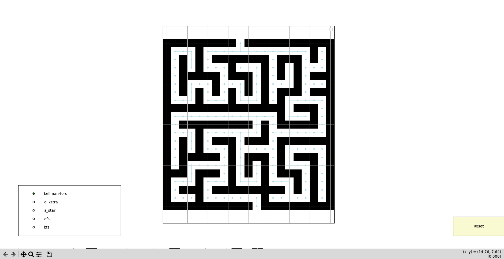
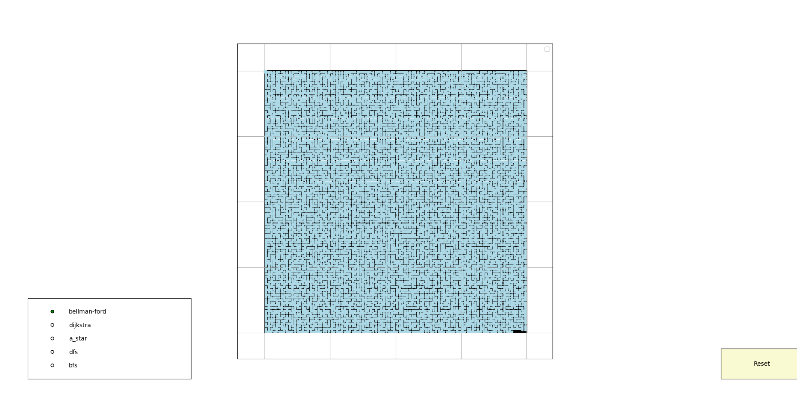
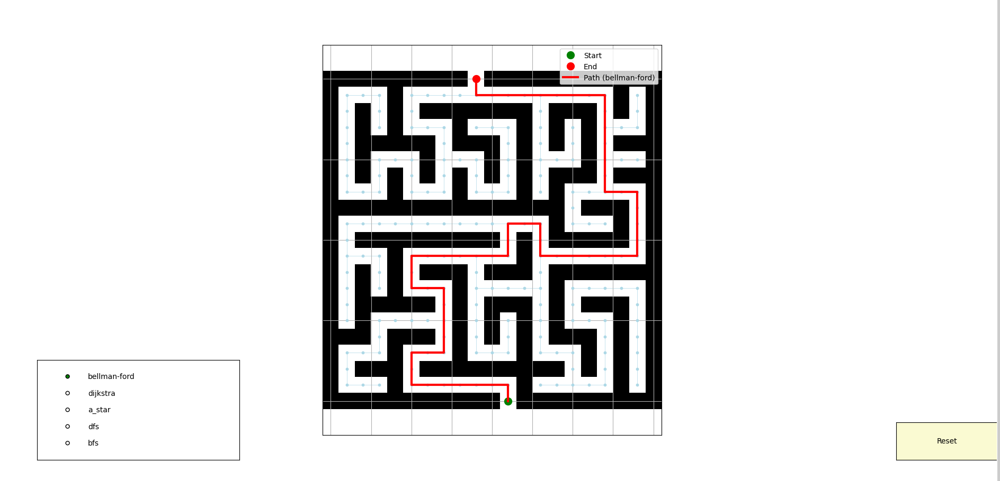

# Path Planner

> Work in progress

Path planner is a package to experiment with different path planning algorithms.

## Algorithms used:

- Dijkstra
- Bellman-Ford
- A*
- RRT
- RRT*

And, their variants.

## Main Dependencies

- NumPy
- Matplotlib
- NetworkX

## Components

The package consists of 3 parts:

- **The algorithm solver server** for selecting between different algorithms.
- **The graph server** for representation .
- **The workers server** for parallization and concurrency.
- **The plotter server** for visualization.

## How it works

Create you maze text file for the program to load it up, here are some examples:

- Simple maze:

- Complex maze:

Choose your start and endpoint and the solver algorithm:

